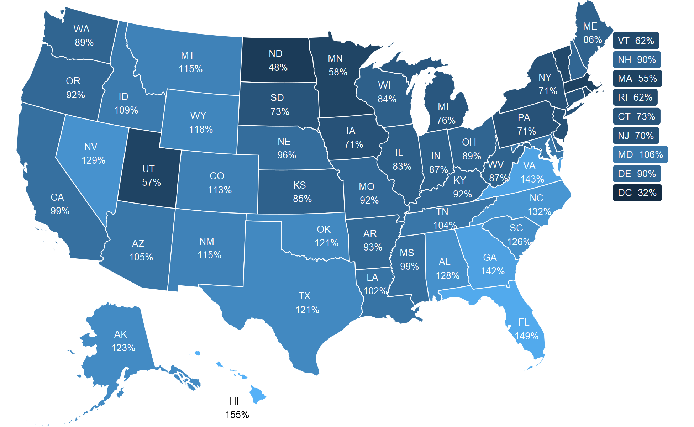

``` {r setup}
library(usmap)
library(ggplot2)
library(Cairo)
library(dplyr)
library(ggrepel)
```

## Introduction

## Data import
``` {r data}
# https://www.opa.mil/research-analysis/recruiting-awareness/population-representation/2020-population-representation-in-the-military-services/population-representation-in-the-military-services-fy20-appendix-b-active-component-accessions-and-force/
df <- read.csv("data/poprep2020.csv")

state_centroid <- usmapdata::centroid_labels("states") %>%
  subset(select = c(x,y,full,abbr)) %>%
  mutate(c.x = x) %>%
  mutate(c.y = y) %>%
  subset(select = c(c.x,c.y,full,abbr))

small_states <- c("VT","NH","MA","RI","CT","NJ","DE","MD","DC")

df <- left_join(df, state_centroid, by = "full") %>%
  mutate(pct = scales::percent(representation_ratio, accuracy = 1)) %>%
  mutate(lbl = paste(abbr, "\n", pct)) %>%
  mutate(sml = ifelse(abbr %in% small_states,1,0)) %>%
  mutate(lbl = ifelse(abbr %in% small_states, paste(abbr, "", pct),lbl)) %>%
  mutate(sml = ifelse(abbr %in% c("HI"),2,sml))

poly <- us_map(regions = "states")
poly <- left_join(poly, df[c("full", "representation_ratio")], by = "full")
```

## Map plotting
``` {r map_plot}
p <- ggplot()
p <- p + geom_polygon(data = poly, 
                      aes(x, y, group = group, fill = representation_ratio), 
                      color = 'white',
                      size = .25)
p <- p + geom_text(data = df %>% filter(sml == 0), 
                   aes(x = c.x, y = c.y, label = lbl), 
                   size = 2.25,
                   color = "white")
p <- p + geom_label_repel(data = df %>% filter(sml == 1), 
                          aes(x = c.x, y = c.y, label = lbl, fill = representation_ratio),
                          segment.size = NA, 
                          size = 2.25,
                          ylim = c(-Inf,500000), 
                          xlim = c(2500000,Inf), 
                          direction  = "y",
                          box.padding = .025,
                          color = "white")
p <- p + geom_text_repel(data = df %>% filter(sml == 2), 
                         aes(x = c.x, y = c.y, label = lbl),
                         size = 2.25)
p <- p + coord_equal()
p <- p + scale_x_continuous(limits = c(-2010000,3000000), expand = c(0,0)) 
p <- p + scale_y_continuous(expand = c(0,0)) 
p <- p + scale_fill_gradient()
p <- p + theme_void()
p <- p + theme(legend.position = "none")
# p

ggsave("img/map.png",
       plot = p,
       scale = 1,
       width = 6.5,
       height = 4,
       units = "in",
       dpi = 300,
       type = "cairo-png")
```
